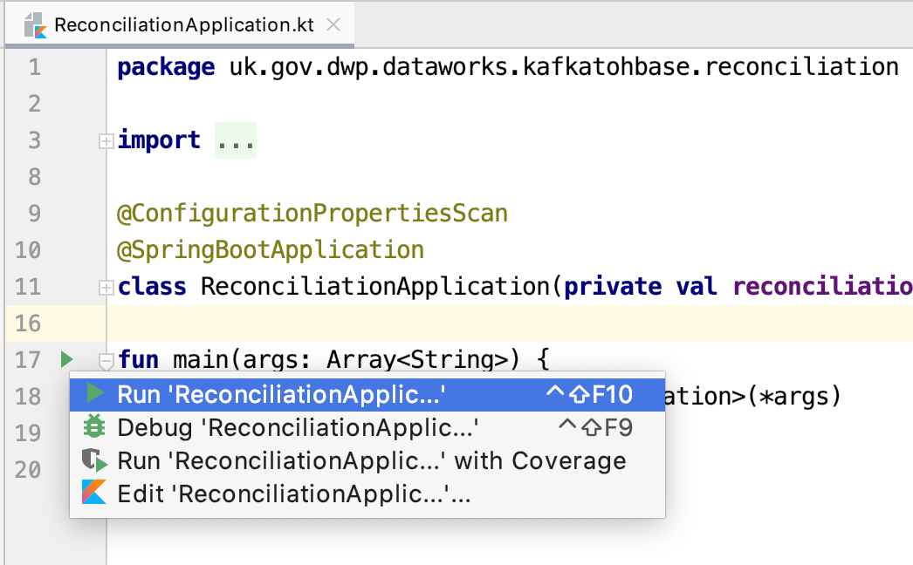
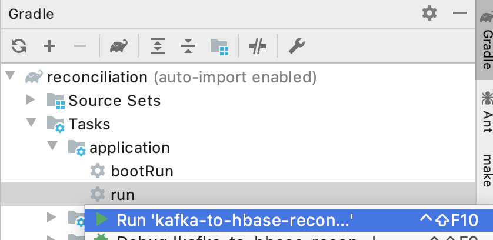
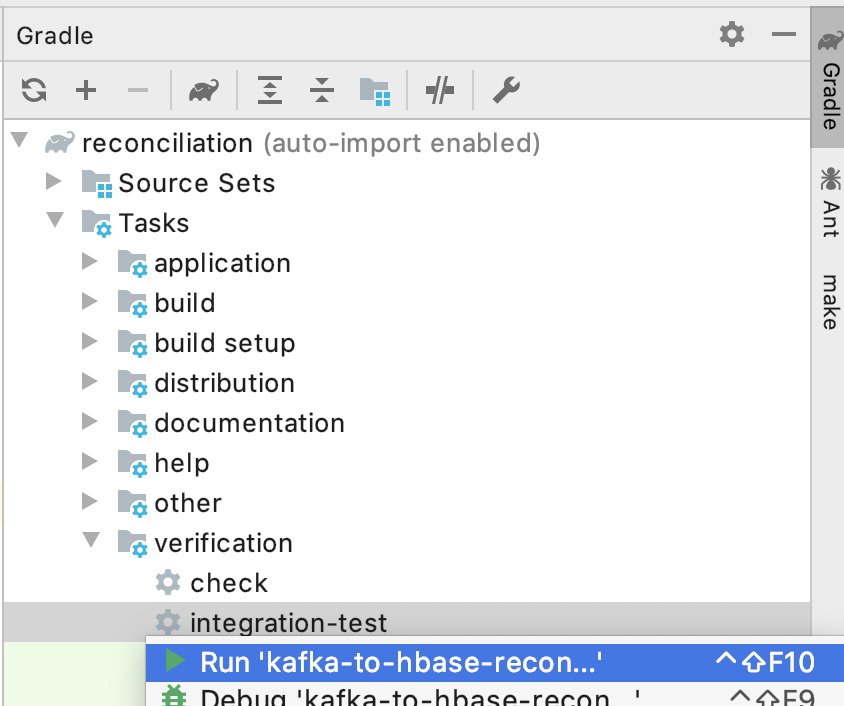

# kafka-to-hbase-reconciliation

## Reconciliation tool to confirm that messages written from Kafka have been successfully written to HBase

This repo contains Makefile, and Dockerfile to fit the standard pattern.
This repo is a base to create new Docker image repos, adding the githooks submodule, making the repo ready for use.

After cloning this repo, please run:  
```
make bootstrap
```

## Local runs of build

Use this command to build and unit test and make a local distribution;
```
make local-all
```

## Local runs of integration tests in docker compose stack

**NOTE** depends on the local build above. This is build into the makefile commands above.

Use this command to build and unit test and make a local distribution, then run all the integration tests;
```
make integration-all
```

## Local running in an IDE

You can do this for both the application, and the integration tests.

* Make a local run configuration in i.e. Intellij from the gradle menu (see images below).
* For the app: 
  * 
  * or
  * 
* For the integration tests: 
  * 

Either, with local application.properties
* Verify the that the [local application.properties](application.properties) matches all current docker compose settings

Or, with env vars
* Make a list duplicating the docker compose settings

Then, for either
* Edit it. 
  * Verify you have all the same settings that are used for the local docker stack.
  * Change the addresses of all hosts to `localhost` or `127.0.0.1`.
  * `HBASE_ZOOKEEPER_QUORUM=localhost`
  * `METADATASTORE_ENDPOINT=localhost`
* The ports exposed by the containers should already match.

Then for both,
* Add env vars for the logger - in intellij you can paste in this csv:
```
CONTAINER_VERSION=latest
ENVIRONMENT=local-ids
APPLICATION_NAME=reconciliation
APP_VERSION=test
LOG_LEVEL=DEBUG
```
* Run the application/test target you just made, it should start and connect up.

## Environment variables needed by the ECS container

These translate into the spring properties the application needs to run
 
|Name|Use|                                                                                                                                                                                    
|----|---|                                                                                                                                                                                    
| SECRETS_REGION | Where the application is run e.g. `eu-west-2` |                                                                                                                                                                          
| HBASE_TABLE_PATTERN | Should actually match the topics on the kafka broker e.g. `db\.([-\w]+)\.([-\w]+)`|                                                                                                                                                                     
| HBASE_ZOOKEEPER_PARENT | The node in zookeeper that identifies hbase e.g. `/hbase` |                                                                                                                                                                  
| HBASE_ZOOKEEPER_PORT | The port to use to connect to zookeeper e.e. `2181` |                                                                                                                                                                    
| HBASE_ZOOKEEPER_QUORUM | The zookeeper host e.g. `hbase.dataworks.dwp.gov.uk` |                                                                                                                                                                  
| HBASE_RPC_TIMEOUT_MILLISECONDS | How long HBase client applications take for a remote call to time out. |                                                                                                                                                          
| HBASE_CLIENT_OPERATION_TIMEOUT_MS | Top-level restriction that makes sure a blocking operation in Table will not be blocked more than this |                                                                                                                                                       
| METADATASTORE_USER | The user to use when connecting to the metadatastore e.g. `reconciler` |                                                                                                                                                                      
| METADATASTORE_PASSWORD_SECRET_NAME | The name of the secret manager secret used to store the database users password  |                                                                                                                                                      
| METADATASTORE_DATABASE_NAME | The database that holds the reconciler table e.g. `metadatastore` |                                                                                                                                                             
| METADATASTORE_ENDPOINT | The reconciler database host or endpoint |                                                                                                                                                                  
| METADATASTORE_PORT | The port to connect to when establishing metadata store connection, e.g. `3306` |                                                                                                                                                                      
| METADATASTORE_TABLE | The table of entries that must be reconciled e.g. `ucfs` |                                                                                                                                                                     
| METADATASTORE_CA_CERT_PATH | The client certificate to use to establish a database connection in AWS |                                                                                                                                                              
| METADATASTORE_USE_AWS_SECRETS | Whether to look up the metadatastore password in aws secret manager |                                                                                                                                                           
| METADATASTORE_TRIM_RECORDS_SCALE |  Used with `METADATASTORE_TRIM_RECORDS_UNIT` to determine the age over which reconciled records are deleted e.g. 10 |                                                                                                                                                        
| METADATASTORE_TRIM_RECORDS_UNIT | Used with `METADATASTORE_TRIM_RECORDS_SCALE` to determine the age over which reconciled records are deleted e.g. `DAYS` |                                                                                                                                                         
| METADATASTORE_NUMBER_OF_PARALLEL_UPDATES | When updating reconciled records how many parallel updates to run. |                                                                                                                                                
| METADATASTORE_BATCH_SIZE | The number of unreconciled records to read at a time. |                                                                                                                                                                
| RECONCILER_FIXED_DELAY_MILLIS | How long to wait in between each round of reconcilliation e.g. `10000` |                                                                                                                                                           
| RECONCILER_LAST_CHECKED_SCALE | Used with `RECONCILER_LAST_CHECKED_UNIT` to determine how long a record should be left until checked again, e.g. 'DAY' |                                                                                                                                                            
| RECONCILER_LAST_CHECKED_UNIT  | See `RECONCILER_LAST_CHECKED_SCALE` e.g.  `5` |                                                                                                                                                         
| RECONCILER_MINIMUMAGESCALE | To configure what age of records to ignore, used in conjunction with `RECONCILER_MINIMUMAGEUNIT` e.g. `15`, entries newer than the configured age are not selected for reconciliation.  |                                                                                                                                                              
| RECONCILER_MINIMUMAGEUNIT |  To configure what age of records to ignore, used in conjunction with `RECONCILER_MINIMUMAGESCALE` e.g. `minutes`, entries newer than the configured age are not selected for reconciliation.  |                                                                                                                                                               
| RECONCILER_OPTIMIZE_AFTER_DELETE | Whether to optimize the table after a delete (only does so if > 0 records deleted). |
| RECONCILER_TRIM_RECORDS_FIXED_DELAY_MILLIS | How long to wait in between each run of the trimmer. |                                                                                                                                              
| SPRING_PROFILES_ACTIVE | `DUMMY_SECRETS` - don't get password from AWS, `HBASE` - don't establish hbase connection, `RECONCILIATION` - run in reconcilliation mode, `SINGLE_CONNECTION` - disable the connection pool - use a single connection, `TRIM_RECONCILED_RECORDS` run in aggressive 'trim' mode i.e. delete all reconciled records, `TRIM_OLDER_RECONCILED_RECORDS` only delete reconciled records that are older than the configured interval |                                                                                                                                                                  
                                                                                                                                                                                              
